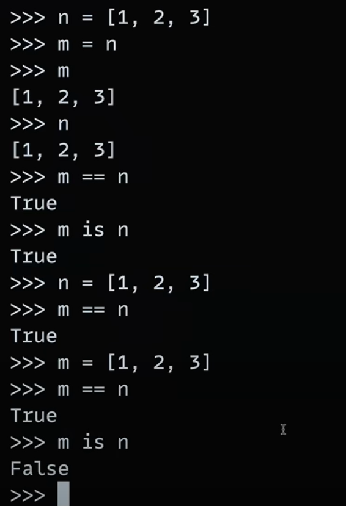

Generally when bytecode file is created when we run our file is hidden-- but when we run a file which have imported any other file , then that will create byte code file in forlder __pycache__/ by name(imported_file_name-python_extension_version.pyc).

To reload new content of a file in terminal mode - 
    from importlib import reload 
    reload(file_name which needs to reload).

 BASIC UNDERSTANDING -----------
a = a + 1
    This is an assignment statement.
    It takes the current value of a, adds 1, and assigns the result back to a.
    Always creates a NEW OBJECT/value (in languages like Python for immutable types).

a += 1
    This is a compound assignment (or shorthand assignment).
    It’s equivalent in result to a = a + 1 for immutable types (like Python integers), but for mutable types (like lists), it can modify in-place.

NOTE -> += modifies the list in-place.
        = with + creates a new list and assigns it.

m == n -> Check whether values inside m and n are same or not 
m is n -> Check whether m and n object points to same refernce or not
When we assign same value in the list then it will point to different refer

Generally python have Garbage Collection -> It means after assing new values it points to new reference and garbage collect the older one-
but in case of Number or String type -> Garbage Collection doen't occur immdiately it happens after some time.

boolean + any_other_data_types = result(any_other_data_types) -> Bool behaves like int (True=1, False=0)

performing operations on two int can give float values.

Important Points About Python Operations on Data Types----------

1. Numbers (int, float, complex) Support All Arithmetic Operators
    +, -, *, /, //, %, ** all work.
    Mixing int and float results in float.
    Mixing complex with int or float results in complex.

2. Division Always Returns Float
    Even 10 / 2 → 5.0 (float), never integer.
    Use // for floor division to get integer part only.

3. Boolean Values Act as Integers
    True is 1, False is 0.
    You can do True + 2 → 3.
    Beware: mixing bool with strings or lists leads to errors.

4. Strings Support Only + and * Operators
    + concatenates strings.
    * repeats strings by integer count.
    You cannot do "abc" - "a" or "abc" / 3 → raises TypeError.
    Trying to mix string with numbers using + without explicit conversion raises TypeError.

5. Lists and Tuples Support + and *
    list + list → concatenates lists.
    tuple + tuple → concatenates tuples.
    list * int or tuple * int → repeats sequence.
    list * float or tuple * float → TypeError.

6. Implicit Conversion Doesn’t Happen Between Strings and Numbers
    "10" + 5 raises TypeError.
    You must convert explicitly: "10" + str(5) or int("10") + 5.

7. None Cannot Be Used in Arithmetic
    None + 1 → TypeError.
    None is for absence of value, not a number.

8. Mutable vs Immutable Types Affect Operations
    Numbers, strings, tuples are immutable — operations produce new objects.
    Lists are mutable — some operations like += modify in place.
    a = [1,2]; b = a; a += [3] modifies a and b (both same list).
    a = [1,2]; b = a; a = a + [3] creates new list for a but b remains unchanged.

9. Complex Numbers Support Only Arithmetic, No Ordering
    complex supports +, -, *, /, **.
    Cannot use comparison operators like <, > → raises TypeError.

10. Mixing Types Can Lead to TypeErrors
    Examples to watch out for:
    str + int → error
    str * float → error
    list + tuple → error
    bool + str → error
    complex + str → error

11. Operator Overloading
    Classes can define behavior for operators (__add__, __mul__, etc.).
    Built-in types have their own implementations.
    Custom objects may behave differently depending on implemented methods.

12. Type Conversion Functions Are Your Friend
    Use int(), float(), str(), complex() to convert explicitly.
    Helps avoid unexpected TypeError.

13. Floor Division (//)
    Works differently for negative numbers vs normal division.
    Example: -3 // 2 → -2 (floors towards minus infinity).

14. Order of Operations Follows Normal Math Precedence
    ** (power) first, then *, /, //, %, then +, -.

15. Use type() to Debug
    When confused about operation result, check operand types:
    print(type(a), type(b))

How Python works internally--------

    Python Source Code  
            ↓
    Tokenization (Lexer)
        ↓
      Parsing (AST)
        ↓
    Bytecode Compilation (.pyc)
        ↓
    Python Virtual Machine (PVM)
        ↓
    Execution + Memory Mgmt + GC

Bonus: Why Python is Slower than Compiled Languages?
    Python runs bytecode on a virtual machine, not directly on CPU.
    It’s interpreted, not compiled to machine code.
    Dynamic typing and runtime checks add overhead.
    But it gains great flexibility and ease of use.

<!-- Data types -->

- Number : 1234,2.3,3+4j,Decimal(),Fraction()
- String
- List
- Dict
- Set
- ByteCode
- Tuple

1. What is a Dictionary in Python?
A dictionary is a mutable, unordered collection of key-value pairs.
It works like a real-world dictionary: you look up a key to get its value.

Syntax:

python
Copy code
my_dict = {key1: value1, key2: value2, ...}
Keys → must be immutable (e.g., string, number, tuple without mutable elements).

Values → can be anything (numbers, strings, lists, other dicts, etc.).

2. Why People Get Confused
Some common confusions:

Keys must be unique – if repeated, last assignment wins.

Unordered until Python 3.6 – now it preserves insertion order (since Python 3.7+ officially).

Mutable nature – modifying affects references.

Using mutable objects as keys – leads to error.

Shallow vs. deep copy – copying a dict does not copy nested structures.

Iteration gives keys by default, not values.

3. Examples & Confusion Breakers
Example 1: Duplicate keys
python
Copy code
d = {"a": 1, "b": 2, "a": 3}
print(d)
Output:

arduino
Copy code
{'a': 3, 'b': 2}
"a" is duplicated → last value (3) overrides earlier (1).

Example 2: Mutable values
python
Copy code
list1 = [1, 2]
d = {"numbers": list1}
list1.append(3)
print(d)
Output:

bash
Copy code
{'numbers': [1, 2, 3]}
Because the value is a reference, changing list1 changes the dictionary’s value.

Example 3: Invalid keys (mutable types)
python
Copy code
# Invalid: list as key
d = {[1, 2]: "test"}  
Error:

bash
Copy code
TypeError: unhashable type: 'list'
Keys must be hashable (immutable). Lists aren’t hashable, but tuples can be:

python
Copy code
d = {(1, 2): "test"}  # ✅ Works
Example 4: Dictionary inside dictionary
python
Copy code
student = {
    "name": "Ishu",
    "marks": {"math": 90, "science": 95}
}
print(student["marks"]["science"])  # 95
Useful for nested data.

Example 5: Iteration behavior
python
Copy code
d = {"a": 10, "b": 20}
for x in d:
    print(x)  # Prints only keys
If you want both:

python
Copy code
for k, v in d.items():
    print(k, v)
Example 6: Shallow vs Deep Copy
python
Copy code
import copy

original = {"numbers": [1, 2]}
shallow_copy = original.copy()
deep_copy = copy.deepcopy(original)

original["numbers"].append(3)

print(shallow_copy)  # {'numbers': [1, 2, 3]}
print(deep_copy)     # {'numbers': [1, 2]}
copy() → copies references (shallow).

deepcopy() → fully independent copy.

4. Useful Dictionary Methods
Method	Description
.keys()	Returns keys
.values()	Returns values
.items()	Returns (key, value) pairs
.get(key, def)	Returns value or default if key not found
.update()	Merges another dictionary
.pop(key)	Removes key and returns its value
.clear()	Removes all items

5. Real-life Example
python
Copy code
employee = {
    "name": "Arsh",
    "id": 101,
    "skills": ["Python", "SQL"],
    "salary": {"basic": 50000, "bonus": 10000}
}

print(employee["skills"][0])  # Python
print(employee["salary"]["bonus"])  # 10000
Here, you can store complex structured data.

